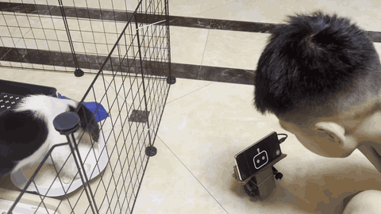
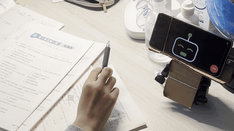
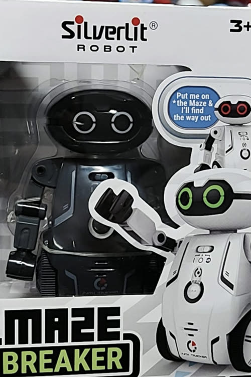
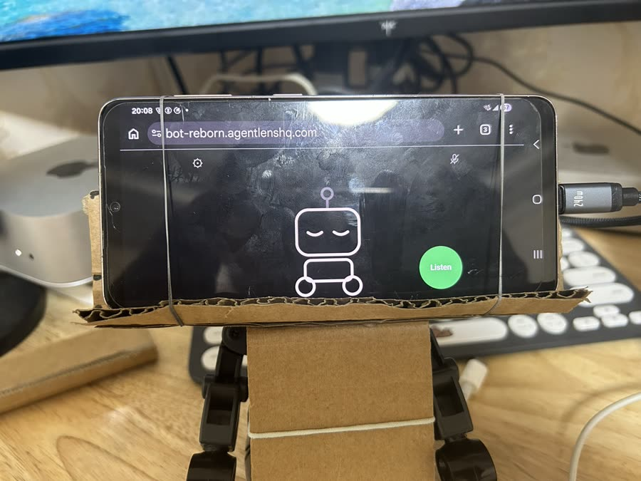
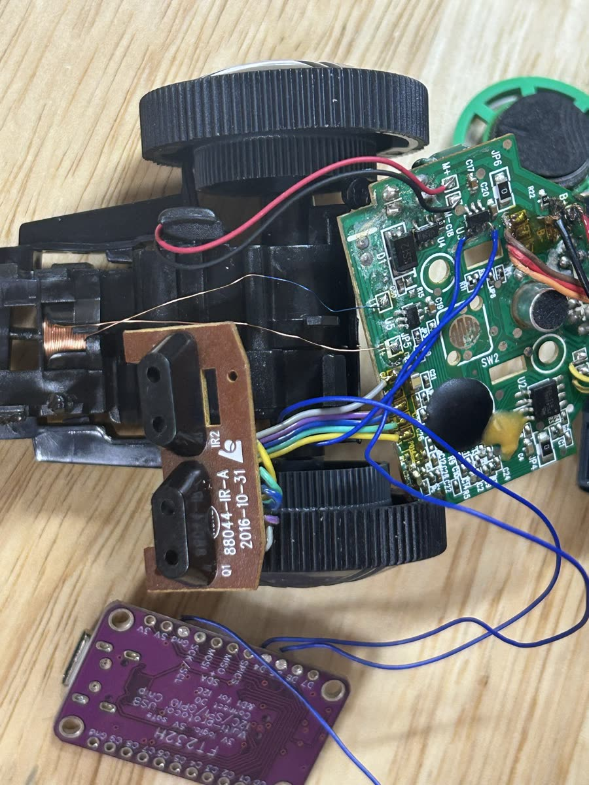

# bot-reborn

**Turn a $4 toy robot into an AI robot, with an old phone as its brain.**

*Real dog: busy eating. Robot dog: on duty.* — [watch the Short, with sound](https://youtube.com/shorts/SNA9ok1j0Sg)

*Kid: has questions. Robot: has attitude.* — [watch the Short, with sound](https://youtube.com/shorts/3Y984t1W6nc)

<table>
  <tr>
    <td align="center"></td>
    <td align="center"></td>
  </tr>
  <tr>
    <td align="center">Before: a line-following toy</td>
    <td align="center">After: the head is gone, the phone is the face</td>
  </tr>
</table>

## What it does

- **You talk, it drives and answers.** "Go forward two seconds, then turn
  left".
- **Bark at it and it barks back.** A bark is caught before any chat model is
  asked, and it answers from a fixed routine: bark, then bark and turn tail,
  then whimper and retreat. Optional.
- **It listens while its screen is on.** No wake word needed. Say the stop word
  or hit the stop button and the car stops, whatever it was doing.

## What you need

- **A cheap toy robot or car** with a drive motor and steering. Ours is a
  Silverlit Maze Breaker. It is the only one tested so far, but
  any toy driven by the same kind of motor driver should work the same way.
- **An FT232H breakout board** — the bridge between the phone's USB port and
  the toy's motor driver.
- **An Android phone with Chrome.** The phone talks to the board over WebUSB,
  which iPhones do not have. Plus a USB-C cable to the board.
- **API keys** for speech-to-text, a chat model and text-to-speech. Any
  OpenAI-compatible provider works.
- A soldering iron, some wire, cardboard and rubber bands.

## How it works

The toy's own line-following chip is cut out of the loop. Four wires from the
FT232H go straight to the inputs of the toy's motor driver and steering coil,
and the phone switches those four pins over USB. Everything else — listening,
understanding, deciding, talking — happens in a web page on the phone.

## Build your own

1. **Wire it.** Pin map, wiring and measurements are in
   [`docs/hardware.md`](docs/hardware.md). Read its D6/D7 soldering warning
   before you start.
2. **Open it on the phone** in Chrome: **https://bot-reborn.agentlenshq.com**
   is a ready-hosted copy of this repo, so there is nothing to deploy. The
   robot shows what it is still missing, and each missing part is a step: your
   keys, plugging in the board, and teaching it which way is left.

Your keys stay on the phone, in plain text in the browser's storage, and are
sent only to the providers you chose. There is no server in between. Using
the hosted copy still means trusting whoever serves the page, so if you would
rather not, serve your own: it is a folder of static files with no build step
(`npx wrangler pages deploy web`, or any HTTPS static host — the phone only
allows USB access from a secure page). See
[Security](docs/development.md#security).

## Status

It works end to end on one robot and one phone. Some hardware numbers are
still unmeasured, and the barking routine's timings are first guesses that
still need tuning on the car.

## More

- [`docs/hardware.md`](docs/hardware.md) — wiring, pin map, every measurement
- [`docs/development.md`](docs/development.md) — reading the code, running it
  locally, tests, security, deployment
- [`docs/instruments.md`](docs/instruments.md) — the calibration page behind
  the gear
- [`docs/ui.md`](docs/ui.md) — the robot's face and what each state means
- [`docs/promo-video.md`](docs/promo-video.md) — what making the video taught us

## License

[MIT](LICENSE). The sounds in `web/sounds/` are CC0 — see their
[credits](web/sounds/CREDITS.md).
