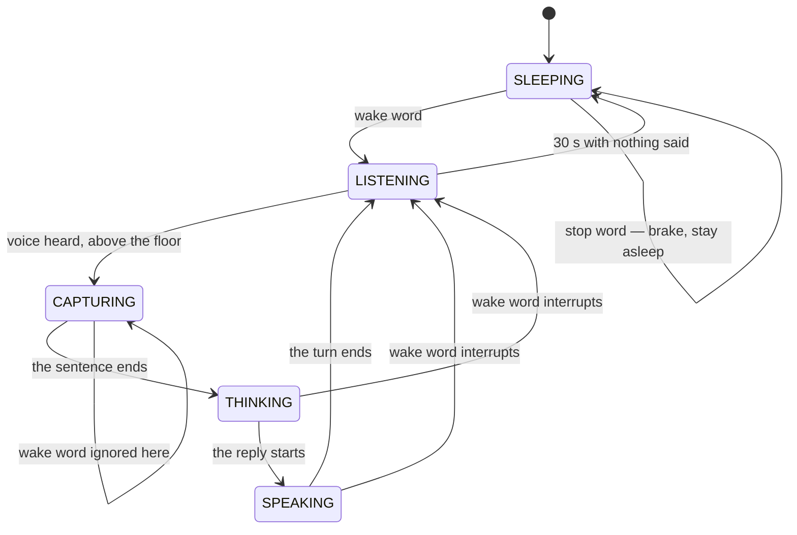
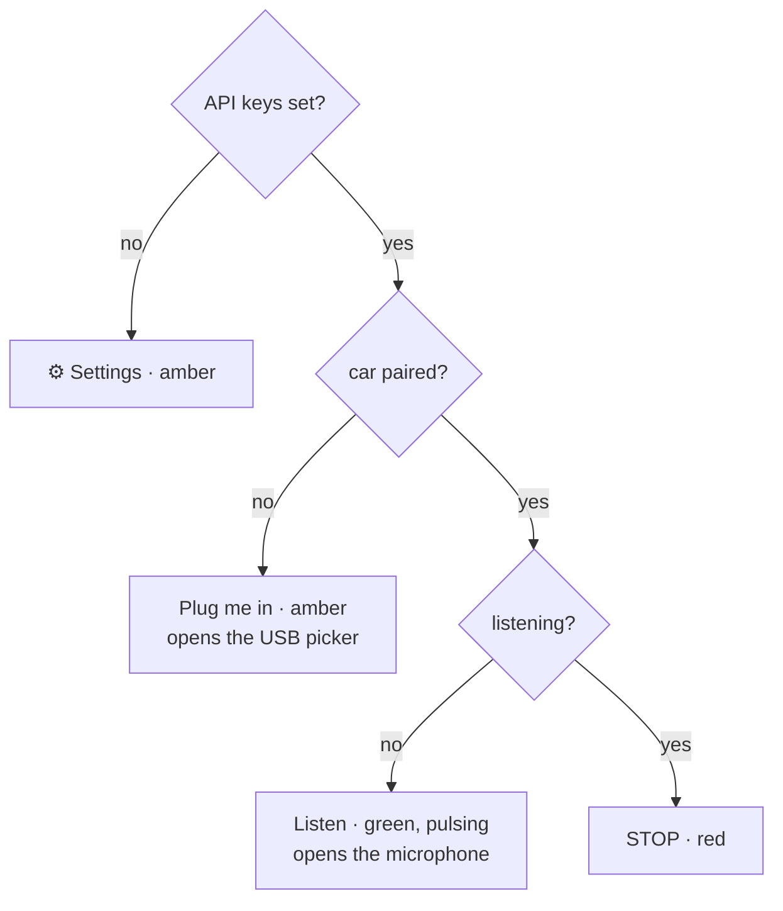

# The screen

What the product page shows, and why each part of it is that shape. The
authority for behaviour is `web/robot.js` and `web/ui.js`; this file exists so
that a reader can see the design without running it.

Everything here is the main page, `web/index.html`. The bench pages
(`bench.html`, `audio-bench.html`) are instruments and are deliberately plain.

---

## One screen, and what is on it

It never scrolls. Anything that does not earn a place here belongs behind the
gear.

```
┌─────────────────────────┐
│ ⚙                       │  settings
│                         │
│      ╭─────────╮        │
│      │ go ahead│        │  bubble — what the robot heard you say
│      ╰────╥────╯        │
│                         │
│         ╭──╮            │
│        ╭┴──┴╮           │  the robot — its face IS the state display
│        │ ●● │           │
│        ╰┬──┬╯           │
│         ○  ○            │
│    say "hey steven"     │  hint — only while the microphone is open
│                         │
│                  ╭────╮ │
│                  │STOP│ │  one button, always the most urgent thing
│                  ╰────╯ │
│  ┌───────────────────┐  │
│  │    Let it sleep    │  │
│  └───────────────────┘  │
└─────────────────────────┘
```

**The bubble is the transcript**, not a log — one line, the most recent, hidden
when empty. It is there so that a child can see the robot misheard them. Before
this screen existed `ui.setTranscript()` had no call site at all, so a wrong
transcription was invisible and looked like the car ignoring an instruction.

**"Let it sleep" is not the stop button.** One means *I am done playing*, the
other means *stop now*; they must not look alike, which is why one is a plain
bar at the bottom and the other is a red disc that never moves. Going to sleep
does not take the stop away — the car may still be rolling.

---

## The robot's five faces

`session.js` owns five states. The face is the display for all of them, so the
screen needs no words for any of it.



| State | Eyes | Antenna | Also | Motion | Tint | Reads as |
|---|---|---|---|---|---|---|
| `SLEEPING` | closed | off | — | breathing | dim | it is asleep |
| `LISTENING` | open | lit | halo pushing outward | bobbing | green | awake, waiting for you |
| `CAPTURING` | open | lit | **sound waves** either side | bobbing | green | it can hear you |
| `THINKING` | looking up | orbiting | — | still | amber | working, wait |
| `SPEAKING` | smiling | lit | mouth opening with the syllables | bobbing | green | it is talking |

**`LISTENING` and `CAPTURING` differ only by the sound waves, and that pair is
load-bearing.** One means *you may speak*, the other means *I hear you*. With
them collapsed a child cannot tell when to start, and nothing else on the
screen says it. `test/robot.test.js` pins the two together so a later tidy-up
cannot quietly merge them.

**`CAPTURING` is honest about a threshold.** It is entered when the VAD reports
speech *and* the frame is louder than `SPEECH_FLOOR_DB` (−40 dBFS,
`session.js`). Speak too quietly and the robot does not react — which is the
point. Before the floor existed, quiet speech was swallowed with no sign.

### Two things that are not faces

The microphone being open, and the car never having been paired, are not states
of the session — `SLEEPING` already covers "not doing anything". They ride on
the element as `data-live` and `data-need`, and the stylesheet combines them
with whichever face is current.

| Flag | When | What changes |
|---|---|---|
| `data-live="true"` | the microphone is open | a sleeping robot's antenna lights: asleep, but listening for its name |
| `data-need="car"` | no car has been paired | a plug works its way into the robot's side, on a loop |

The first exists because *asleep with the microphone shut* and *asleep waiting
to hear its name* are one state and two entirely different situations. §5.3
keeps the keyword spotter subscribed all through `SLEEPING`, so the second one
really is listening, and the screen should say so.

---

## The one button

One button, one fixed place, and its face is whatever is most urgent right now.
The first rungs are passed once each, so the muscle memory that forms is for
the last one.



**Why the emergency stop is this button and not one in a row of them.** Spec
§4.1 puts it at layer 2: while JS is alive and doing the wrong thing it is the
only thing a person can do. The requirement it states is that at the moment the
car is about to get away, the button has to be where the eyes already are — and
a disc that never moves beats a red rectangle among other rectangles.

**"Listen" opens the microphone; it does not wake the robot.** Whether the
robot wakes is up to whoever says its name. The button said "Wake it" for one
afternoon and that was a lie people acted on.

**Pairing is its own rung because a gesture cannot be saved.**
`navigator.usb.requestDevice()` needs a user gesture, and by the time `start()`
would notice the car was missing it has spent its own on several awaits. The
product used to download 19 MB, open the microphone, then report the missing
car as a failure of the thing you had just asked for.

---

## Colour

Four meanings, and one of them is reserved.

| | Meaning | Where |
|---|---|---|
| **Red** | the emergency stop, and nothing else, ever | the button, once the car is paired |
| Green | ready, or working normally | the robot awake, "Listen" |
| Amber | your turn — something is waiting for you | the robot thinking, the unfinished rungs |
| Dim | not yet, or asleep | a sleeping robot, checklist rows not reached |

Red is reserved because the button that must be found instantly stops being
findable the moment it is one of several red things. Anything that wants
attention without being urgent uses amber.

---

## Motion

Every animation is decoration on a difference that is already there without it
— eyes, waves, mouth, tint, the plug's position. `prefers-reduced-motion`
switches them all off and the five states stay distinguishable. If they ever
stop being distinguishable with motion off, that is a design bug and not an
accessibility footnote.

---

## Language

The product page follows `strings.js` and ships in English. The `zh` table is
complete and is a locale, not dead code; nothing selects it until there is a
switcher, which arrives with i18n proper. Inferring the language from
`navigator.language` was dropped on 2026-09-17: for an open-source project the
default has to be the language its readers share, and inferring one made the
source's default and the running default two different things.

The wake-word hint is composed from `KEYWORDS[0]` when it is drawn, never
stored as a finished sentence. A string containing the wake word is a string
the TTS could one day read aloud, and the robot would answer itself.
`test/strings.test.js` enforces this.
