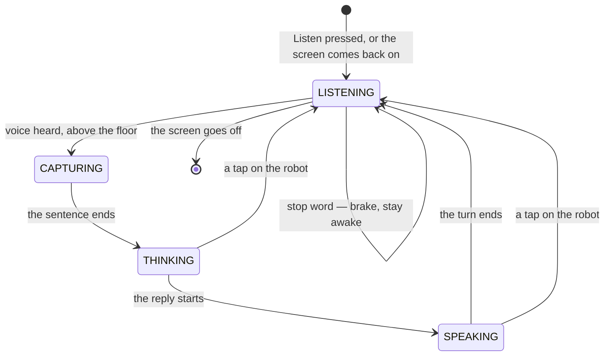
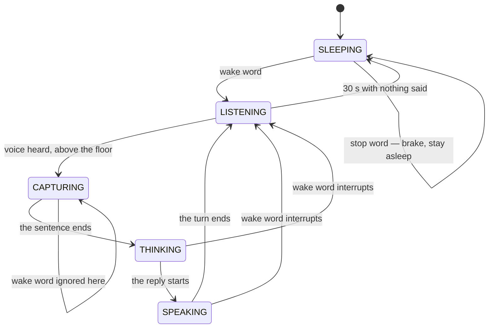
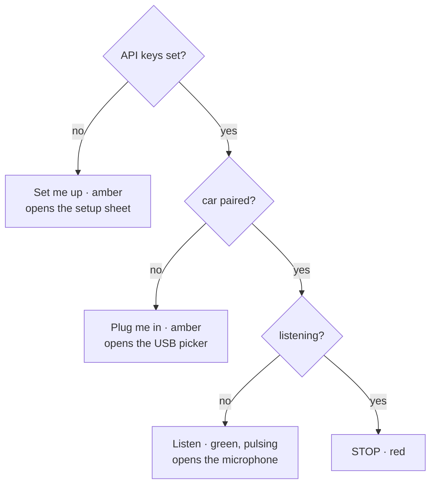

# The screen

What the product page shows, and why each part of it is that shape. The
authority for behaviour is `web/robot.js` and `web/ui.js`; this file exists so
that a reader can see the design without running it.

Everything here is the main page, `web/index.html`. The bench pages
(`bench.html`, `audio-bench.html`) are instruments and are deliberately plain.

---

## One screen, and what is on it

It never scrolls. Anything that does not earn a place here belongs behind the
gear.

```
┌─────────────────────────┐
│ ⚙                       │  settings
│                         │
│      ╭─────────╮        │
│      │ go ahead│        │  bubble — what the robot heard you say
│      ╰────╥────╯        │
│                         │
│         ╭──╮            │
│        ╭┴──┴╮           │  the robot — its face IS the state display
│        │ ●● │           │
│        ╰┬──┬╯           │
│         ○  ○            │
│    say "hey steven"     │  hint — only with the wake word switched on
│                         │
│                  ╭────╮ │
│                  │STOP│ │  one button, always the most urgent thing
│                  ╰────╯ │
│  ┌───────────────────┐  │
│  │    Let it sleep    │  │
│  └───────────────────┘  │
└─────────────────────────┘
```

**The bubble is the transcript**, not a log — one line, the most recent, hidden
when empty. It is there so that a child can see the robot misheard them. Before
this screen existed `ui.setTranscript()` had no call site at all, so a wrong
transcription was invisible and looked like the car ignoring an instruction.

**"Let it sleep" is not the stop button.** One means *I am done playing*, the
other means *stop now*; they must not look alike, which is why one is a plain
bar at the bottom and the other is a red disc that never moves. Going to sleep
does not take the stop away — the car may still be rolling.

---

## The screen is the robot's eyes

**Screen on, it is listening; screen off, it is not.** Turning the screen on is
already the robot being called, the way opening an app is, so by default there
is no wake word: "Listen" opens the microphone and the robot opens its eyes with
it. While it listens the screen is held on (Wake Lock). When the screen goes off
anyway — the power button — `app.js` brakes the car and closes the microphone,
and when it comes back on the microphone reopens by itself.

This replaced the keep-alive tone (2026-09-27). Android takes a background
tab's microphone about a minute after the screen goes off; the tone kept it by
borrowing a media session, which is behaviour rather than a contract, and it
could be taken away by any Android update without a word. A robot whose eyes are
shut not hearing you is not a fault to detect; it is the character.

The wake word is still there, off, as a switch in settings. On, it brings back
`SLEEPING`, the thirty-second doze and the hint. The switch is read when the
microphone opens, by the session and the hint alike, so flipping it lands on the
next Listen — never on a robot that is asleep with no name left to wake it.

The stop word is not part of that switch. It lives in the same keyword model,
and it is the brake.

### Once it listens, the screen is its face

The phone rides on the car on its side, on a real body with real wheels, so a
drawing of a whole robot on its screen is a robot inside the robot's head.
While the microphone is open the drawing is cropped to the head —
`VIEWBOX.face` in `robot.js`, 120 × 84, which is landscape — and sized to the
screen from both axes. The body, the wheels and the plug are hidden.

While it is being put together the whole robot stays: the body and the wheels
are two of the checklist's doors, and a ghosted part has to be somewhere. That
is the split — **assemble it, then play with it** — and the microphone being
open is the line between the two, because nothing can open it before the
gating steps are done.

The transcript, the hint and the notice float over the face instead of
stacking around it, so a transcript arriving does not shrink the face
mid-sentence. The part bands are all inert while it runs and are hidden, so a
tap reaches the robot itself: that is how a reply is interrupted.

Installed from the home screen (`manifest.webmanifest`) it opens full screen
and locked to landscape. In a browser tab the top bar offers "Install as app"
whenever Chrome says the page can be installed.

---

## The robot's five faces

`session.js` owns five states. The face is the display for all of them, so the
screen needs no words for any of it. With the wake word off (the default) only
the four awake ones are ever reached:


```mermaid
stateDiagram-v2
    [*] --> LISTENING: Listen pressed, or the screen comes back on
    LISTENING --> CAPTURING: voice heard, above the floor
    CAPTURING --> THINKING: the sentence ends
    THINKING --> SPEAKING: the reply starts
    SPEAKING --> LISTENING: the turn ends
    SPEAKING --> LISTENING: a tap on the robot
    THINKING --> LISTENING: a tap on the robot
    LISTENING --> LISTENING: 30 s with nothing said — car stops, conversation forgotten
    LISTENING --> LISTENING: stop word — brake, stay awake
    LISTENING --> [*]: the screen goes off
```

**The thirty seconds did not go away with `SLEEPING`.** They were never only
about the face: they are also the longest a cruise can run. With nowhere to
sleep to, the car stops and the conversation starts over, silently, and the
robot stays awake.

**A tap on the robot is the wake word's other job.** Saying its name during a
reply used to be the way to cut it off; with no name to say, the tap does the
same — shuts it up, drops the turn, leaves the car alone. While it is only
listening or hearing you, a tap does nothing: a sentence in progress is not
cut.

With the wake word switched on:


```mermaid
stateDiagram-v2
    [*] --> SLEEPING
    SLEEPING --> LISTENING: wake word
    LISTENING --> CAPTURING: voice heard, above the floor
    CAPTURING --> THINKING: the sentence ends
    THINKING --> SPEAKING: the reply starts
    SPEAKING --> LISTENING: the turn ends
    LISTENING --> SLEEPING: 30 s with nothing said
    SPEAKING --> LISTENING: wake word interrupts
    THINKING --> LISTENING: wake word interrupts
    CAPTURING --> CAPTURING: wake word ignored here
    SLEEPING --> SLEEPING: stop word — brake, stay asleep
```

| State | Eyes | Antenna | Also | Motion | Tint | Reads as |
|---|---|---|---|---|---|---|
| `SLEEPING` | closed | off | — | breathing | dim | it is asleep |
| `LISTENING` | open | lit | halo pushing outward | bobbing | green | awake, waiting for you |
| `CAPTURING` | open | lit | **sound waves** either side | bobbing | green | it can hear you |
| `THINKING` | looking up | orbiting | — | still | amber | working, wait |
| `SPEAKING` | smiling | lit | mouth opening with the syllables | bobbing | green | it is talking |

**`LISTENING` and `CAPTURING` differ only by the sound waves, and that pair is
load-bearing.** One means *you may speak*, the other means *I hear you*. With
them collapsed a child cannot tell when to start, and nothing else on the
screen says it. `test/robot.test.js` pins the two together so a later tidy-up
cannot quietly merge them.

**`CAPTURING` is honest about a threshold.** It is entered when the VAD reports
speech *and* the frame is louder than `SPEECH_FLOOR_DB` (−40 dBFS,
`session.js`). Speak too quietly and the robot does not react — which is the
point. Before the floor existed, quiet speech was swallowed with no sign.

### Two things that are not faces

The microphone being open, and the car never having been paired, are not states
of the session — `SLEEPING` already covers "not doing anything". They ride on
the element as `data-live` and `data-need`, and the stylesheet combines them
with whichever face is current.

| Flag | When | What changes |
|---|---|---|
| `data-live="true"` | the microphone is open | a sleeping robot's antenna lights: asleep, but listening for its name |
| `data-need="car"` | no car has been paired | a plug works its way into the robot's side, on a loop |
| `data-missing` | a token list of parts not configured yet | each named part is drawn dashed and pale |

The first exists because *asleep with the microphone shut* and *asleep waiting
to hear its name* are one state and two entirely different situations (with the
wake word switched on — off, an open microphone is never asleep). §5.3
keeps the keyword spotter subscribed all through `SLEEPING`, so the second one
really is listening, and the screen should say so.

### The parts it has not been given yet

The five faces had already put each provider layer somewhere on the drawing,
before anybody went looking for a place to put them:

| Setup row | Part | The face that uses it |
|---|---|---|
| **Ears** | the sound waves beside the head | `CAPTURING` — hearing you |
| **Mind** | the antenna | `THINKING` — the dot orbits |
| **Voice** | the mouth | `SPEAKING` — the mouth opens |
| — | the wheels | (no face; directions are taught, not felt) |

So an unconfigured layer is drawn as **the part that is not there yet**: dashed
and pale, in the place that part will occupy once it works. Filling in a key
makes a ghost disappear. The robot is assembled as it is set up, and "what is
still missing" is answered on the character rather than only in a list.

Dashed rather than a different colour, because the difference that has to read
at a glance is *absent* versus *present and idle*, and colour is already
carrying tint.

**Every ghost rule is scoped to the face not currently using that part**, so a
live face always wins and the drawing never shows a mouth that is both speaking
and absent. The two barely meet in practice: nothing can start before Ears and
Mind are configured, so the only ghost that can share the screen with a running
robot is the mouth of one that was never given a voice — which is exactly what
it is.

**This is finer than the checklist, and does not duplicate it.** The list
answers "how many steps are left", and giving it both keys is one step, one
errand, one sheet. The drawing answers "what is this robot still missing", and
there the ears and the mind are two different absences. `missingParts()` in
`robot.js` is the one place that decides; `steps.js` stays the one place that
decides the other question.

**The wheels go pale from the moment calibration has not been done**, including
while there is no car at all. Both are true then, and the plug and the pale
wheels say different things: nothing is plugged in, and nothing has been taught
which way is which.

Calibration is **two** answers — forward from backward (①b) and left from right
(①) — and the wheels stay pale until both are in. Half an answer is the
dangerous state: a car that knows its sides but not its ends looks ready and
reverses into the wall behind it on the first command. `directionsTaught()` in
`config.js` is the one place that decides, and both the drawing and the button
read it.

### The robot is the checklist

Each region of the drawing is the door to the step it stands for. Press the
head and the setup sheet opens; press the body and the USB picker opens; press
the wheels and it offers to learn which way is which. There is no list in
between, and the step that is next carries a soft ring — nothing else would
tell anybody that a drawing can be touched.

They are real `<button>` elements laid over the SVG, not clicks on the shapes.
The dashed arcs are two pixels wide and a finger is not, and a shape inside an
SVG is not something a screen reader can be handed. The three bands tile the
robot's full height rather than tracing its outline, for the same reason: the
wheels are seventeen pixels tall and a touch target is forty-four.

**A band is a door only while it covers something missing** — a ghosted part,
or the plug. The rest ship `inert`, and `openParts()` switches on the ones that
are showing an absence. A drawing where every inch answers to a tap is a
drawing that taught the ring means nothing.

Doors are drawn from the ghosts rather than from the ring because the two are
not the same answer. The **mouth** is the case that proves it: a voice is
optional, `done.keys` asks only about the ears and the mind, so no step will
ever ring over a missing mouth — and yet a dashed mouth is exactly the thing
somebody will press to ask about it. Under the ring alone it was a picture
that did nothing. `PART_STEP` in `robot.js` is where a part says which sheet
it opens.

It also settles what a *finished* step does, which is nothing, and both of the
things it used to do were surprises:

- Pressing the body re-opened the USB picker on a car that was already plugged
  in. The cable is the control for that step — `getDevices()` only answers with
  devices currently plugged in, so pulling the cable brings the step back by
  itself and plugging the same car in again takes it away without a picker,
  because the permission outlives the unplug. `app.js` listens for `connect`
  and `disconnect` so that happens while you watch.
- Pressing the wheels offered to re-teach a car that already knew. That is a
  once-a-car job after a resolder, and settings already has a row for it; it
  does not need a permanent region on the main screen.

Because one band is live at a time, the boundaries can be chosen for the
drawing instead of for the finger — nothing next to a live band is competing
for the same tap. They sit in the drawing's own gaps: 65% is y=87 of the 134
viewBox, the space between the head and the body; 85% is y=114, the body's
bottom edge. They used to be 55% and 78%, which cut through the mouth and
through the body, so a tap aimed at the mouth opened the USB picker and a tap
aimed at the body offered to teach directions.

The ring and the button's word are set from one `fabRung()` result in one line
of `app.js`, and both land in the same `startStep()`. A tap on the wheels and a
press of a button reading "Teach me which way" cannot turn out to mean two
different things.

---

## The one button

One button, one fixed place, and its face is whatever is most urgent right now.
The first rungs are passed once each, so the muscle memory that forms is for
the last one.


```mermaid
flowchart TD
    A{"API keys set?"} -- no --> B["Set me up · amber<br/>opens the setup sheet"]
    A -- yes --> C{"car paired?"}
    C -- no --> D["Plug me in · amber<br/>opens the USB picker"]
    C -- yes --> E{"listening?"}
    E -- no --> F["Listen · green, pulsing<br/>opens the microphone"]
    E -- yes --> G["STOP · red"]
```

**Why the emergency stop is this button and not one in a row of them.** Spec
§4.1 puts it at layer 2: while JS is alive and doing the wrong thing it is the
only thing a person can do. The requirement it states is that at the moment the
car is about to get away, the button has to be where the eyes already are — and
a disc that never moves beats a red rectangle among other rectangles.

**"Listen" opens the microphone.** With the wake word off, that is also the
robot waking — the two are one act. With it on, whether the robot wakes is up to
whoever says its name; the button said "Wake it" for one afternoon under that
rule and it was a lie people acted on, which is why it still says Listen.

**Pairing is its own rung because a gesture cannot be saved.**
`navigator.usb.requestDevice()` needs a user gesture, and by the time `start()`
would notice the car was missing it has spent its own on several awaits. The
product used to download 19 MB, open the microphone, then report the missing
car as a failure of the thing you had just asked for.

---

## The three sheets

All slide up from the bottom, all are their own backdrop, all close on a tap
outside, and they never stack:

| | opened by | answers |
|---|---|---|
| **Setup** | the head, or the amber button | the three keys |
| **Teach it directions** | the wheels, or the amber button | which way did it go — twice |
| **Settings** | the gear | language, what it picked up by voice, the instruments |

A sheet closes itself before opening another. Two bottom sheets on one phone
screen leave the lower one showing around the edges of the upper, and closing
the top one uncovers a panel that has since gone stale.

**What it hands over instead is the way back.** A sheet opened from another one
is given the function that reopens it, and then shows **two** buttons: *Back*
returns to the drawer it came from, *Close* is done with all of it. They are
different intentions and one button cannot be both. Opened from the robot there
is nothing to hand over, and the only button is *Close*.

On the calibration sheet the pair sits outside the flow rather than at the end
of it, so leaving is possible at every step. It can be opened by mistake, and a
car that has just been told to turn is not a good place to be stuck.

**Settings is not part of getting started.** It used to hold the onboarding
checklist, and the day the robot started showing which parts it had not been
given, the list became a second, worse copy of the same answer — in text, one
screen further away. Nothing behind the gear is ordered, numbered or ticked
now; it is the drawer you go looking in afterwards.

**Setup is three tabs, one per layer, named by what they do for the robot.**
Ears hear you, Mind decides, Voice answers back — not STT, LLM and TTS, which
are the names of the parts we happened to buy.

Tabs rather than three rows on one screen: stacked, that is eleven fields, a
panel scrolling inside a sheet that is already the height of the screen, and a
dropdown somewhere in the middle opening a scrolling list of its own. Setting
up a key is not a form-filling session; it is the same three-field errand done
three times. The tab carries a tick when its layer is complete — that mark is
what lets tabs replace the stack without losing anything, because three open
panels showed at a glance which were empty and three bare words would not.

It opens on the first unfinished layer, not always on the first tab. Somebody
who came back to fix their Voice key should not have to walk past two ticked
layers to reach it.

**Only the key is typed.** The address and the model come from a built-in list,
because they are the same for everybody on the same provider, and every paste
is one more chance to produce a failure that reads as a bad key. Picking
"Other…" puts the fields back.

**Each layer carries its own test, beside its own fields.** One status line at
the foot of the sheet can say that something failed; it cannot say which of
three keys is the wrong one, which is the only thing its reader wants to know.
There is no "test all three" either: the three are configured one at a time and
each is tested where it is configured.

**The Mind test asks for a tool call, not just an answer.** That is not the
test being strict — `brain.js` drives the car through tools, so a model that
can chat and cannot call one is a model this product cannot use. Models are not
filtered out of the list for it: which models support tool calling changes
faster than a hard-coded list can, and a stale list is worse than none when the
test answers authoritatively in two seconds.

**A voice belongs to a model, not to a provider.** On SiliconFlow the speakers
are spelled `<model>:<speaker>`, so changing the model invalidates every voice
name; on OpenAI they stand on their own. The preset table is keyed by model for
that reason, and changing model or provider rewrites the voice if the stored
one no longer belongs to anything.

**The Ears test plays a recording that ships with the repo**, and says so under
every result. It is synthesised, so it is nobody's voice and every clone hears
the same take — which makes it a fair baseline and makes it useless for "does
it understand *me*". That question belongs to `setup.html`, where the clips are
in your own voice.

**There are two recordings, and two lines for the Voice test, one pair per UI
language.** §9.3's "test the hardest case" is a statement about the input this
product actually gets, not a difficulty setting. For a Chinese user the hardest
case is code-switching mid-sentence. For somebody who will only ever speak
English to their robot, that same clip tests a capability they do not need and
can fail a provider that serves them perfectly well — a false negative, which
is worse than no check at all, because it sends them away from a setup that
worked. `lang` is the only signal there is and it can be wrong, so the sheet
shows the transcript it got: a mismatch is then legible rather than mysterious.

**There is no Save.** A key is pasted and the very next thing anybody does is
press Test. A Save in between exists only to be forgotten, and the failure it
produces points at the key.

---

## Colour

Four meanings, and one of them is reserved.

| | Meaning | Where |
|---|---|---|
| **Red** | the emergency stop, and nothing else, ever | the button, once the car is paired |
| Green | ready, or working normally | the robot awake, "Listen" |
| Amber | your turn — something is waiting for you | the robot thinking, the unfinished rungs |
| Dim | not yet, or asleep | a sleeping robot, checklist rows not reached |

Red is reserved because the button that must be found instantly stops being
findable the moment it is one of several red things. Anything that wants
attention without being urgent uses amber.

---

## Motion

Every animation is decoration on a difference that is already there without it
— eyes, waves, mouth, tint, the plug's position. `prefers-reduced-motion`
switches them all off and the five states stay distinguishable. If they ever
stop being distinguishable with motion off, that is a design bug and not an
accessibility footnote.

---

## Language

The product page follows `strings.js` and ships in English. The `zh` table is
complete and is a locale, not dead code; nothing selects it until there is a
switcher, which arrives with i18n proper. Inferring the language from
`navigator.language` was dropped on 2026-09-17: for an open-source project the
default has to be the language its readers share, and inferring one made the
source's default and the running default two different things.

The wake-word hint is composed from `KEYWORDS[0]` when it is drawn, never
stored as a finished sentence. A string containing the wake word is a string
the TTS could one day read aloud, and the robot would answer itself.
`test/strings.test.js` enforces this.
